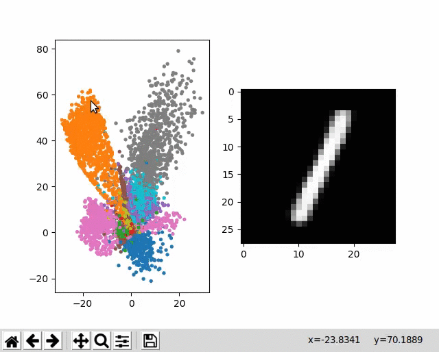

# Autoencoder Latent Space Exploration


## Explanation
On the left is a visual representation of the latent space generated by training a deep autoencoder to project handwritten digits (MNIST dataset) from 784-dimensional space to 2-dimensional space. Notice how the autoencoder learns a clustered representation. When hovering over a pixel on this graph, the current mouse coordinates are used to project back to 784-dimensional space and the decoded vector is shown on the right.

The code in `ae.py` is clean and simple and is intended to aid understanding of autoencoders.

## Usage
To try this out, clone the repository and run 
```shell
python ae.py
```
This requires `tensorflow`, `matplotlib`, `numpy` and `tkinter` (python3).
If that's slow, try running
```shell
python ae_precomp.py
```
This file precomputes all reachable digit decodings instead of computing them in real time on hover, and is faster in some cases.

